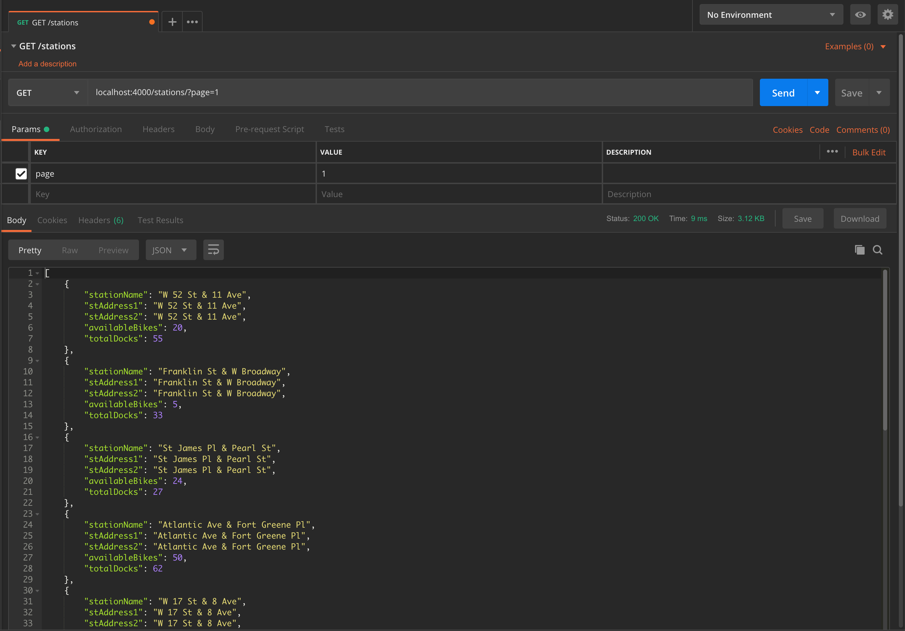
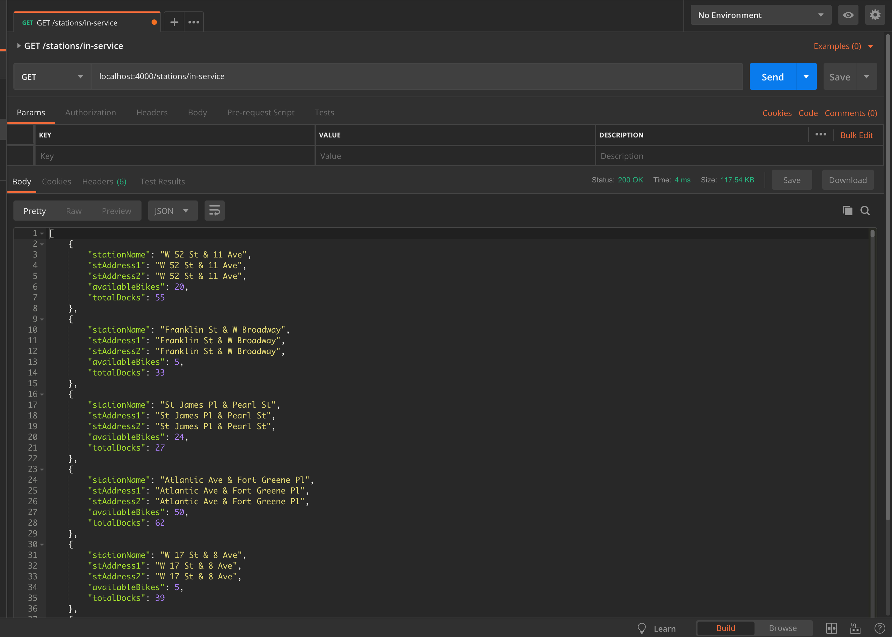
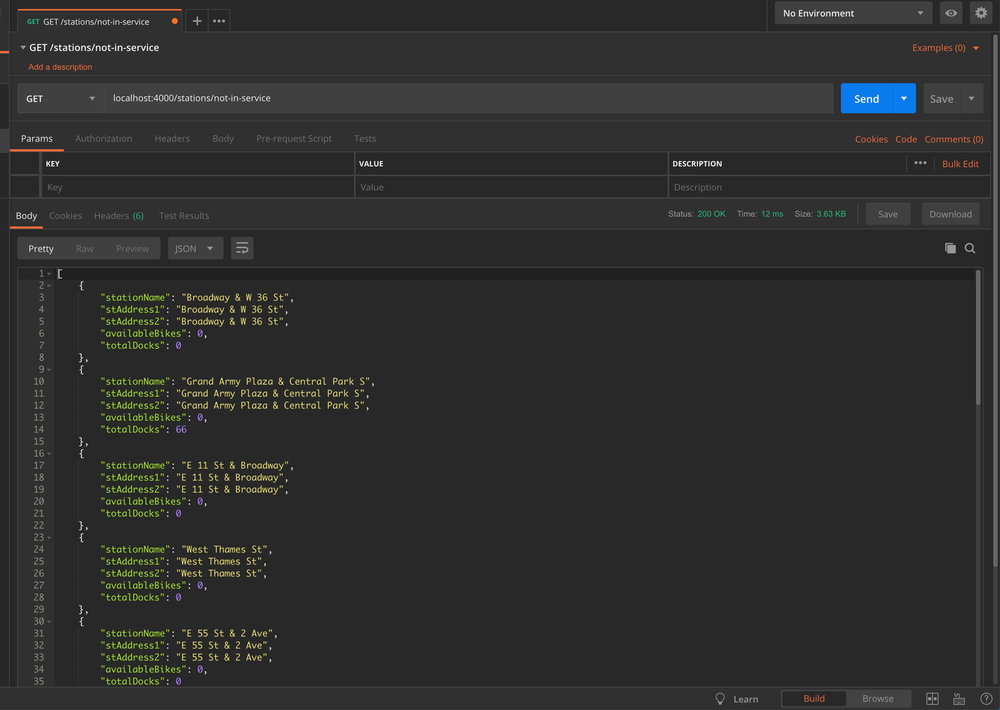
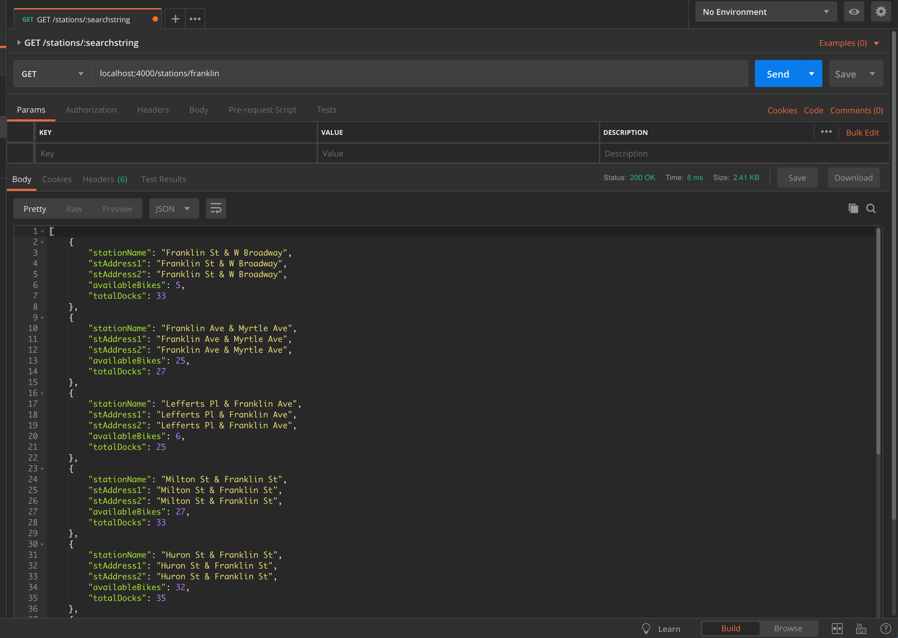
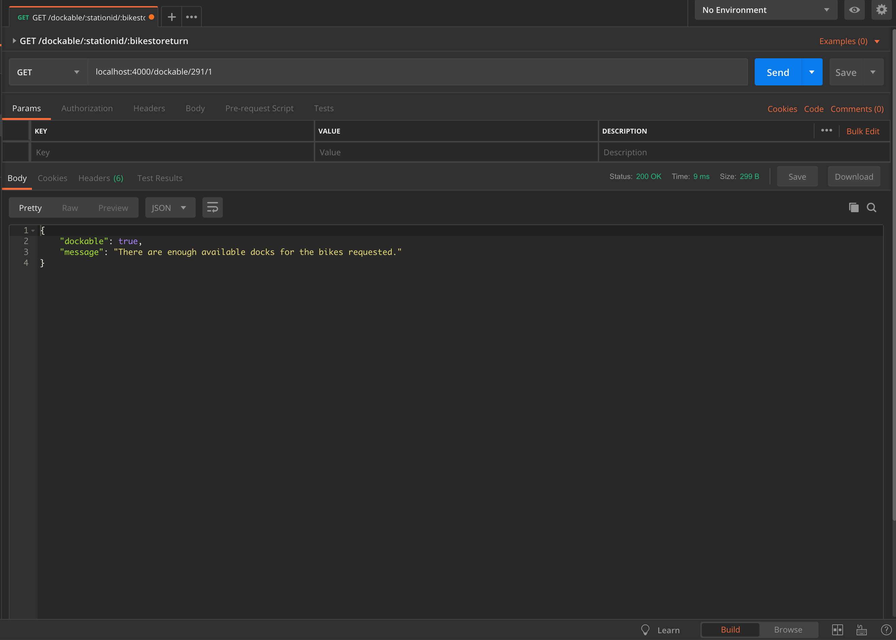

# Features
This is an API for Citi Bikes that was built using Node.JS and Express.

The purpose of this project was to build an API using Citi Bike station data that allows you to:  

- Retrieve information about Citi Bike stations in NYC (with pagination using page query parameter)
- Retrieve information about all in-service Citi Bike stations in NYC (with pagination using query parameter)
- Retrieve information about all not-in-service Citi Bike stations in NYC (with pagination using query parameter)
- Search for a Citi Bike station by using a search string
- Retrieve infromation about whether or not a station is dockable by using station ID and the number of bikes that need to     be returned.

# Installation

Follow these steps to install/run the application: 

1. Clone this github repository
2. Navigate to the root directory of the project and run **npm install**
3. After the modules have been installed, run **npm start** from the root directory
4. The server should now be up. Use http://localhost:4000 to start making requests either in your web browser or in another    client application.

To run tests for this application (after instaling modules), run **npm test** from the root directory.

For this application you can either use an API development platform (such as Postman) or an internet browser to make requests.

# How To Use

## Response Types
There are two main routes that are used in this application: stations and dockable. 

### Station Response Type
The stations endpoint allows a user to retrieve information about a particular station or station(s). The object that is sent as a response when this endpoint is accessed looks like this: 

```js
{
    "stationName": "LaGuardia Pl & W 3 St",
    "stAddress1": "LaGuardia Pl & W 3 St",
    "stAddress2": "LaGuardia Pl & W 3 St",
    "availableBikes": 16,
    "totalDocks": 35
}
```
As shown above, the response from this endpoint reveals basic information about the station(s):

| Property | Type | Description |
|:---------|:-----|:------------|
| **stationName**   | String | Name of the station |
| **stAddress1** | String | Address 1 of the station |
| **stAddress2** | String | Address 2 of the station |
| **availableBikes** | Number | Number of bikes that are currently available at this station|
| **totalDocks** | Number | Total number of docks at this station|


### Dockable Response Type
The dockable endpoint allows a user to check whether or not a station is dockable if the user gives a station ID and the number of bikes they want to return. The object that is sent as a response when this endpoint is accessed looks like this:

```js
{
    "dockable": true,
    "message": "There are enough available docks for the bikes requested."
}
```
As shown above, the response from this endpoint reveals whether or not a station is dockable and a message that provides more detail: 

| Property | Type | Description |
|:---------|:-----|:------------|
| **dockable**   | Boolean | True or False based on if the station has enough docks to accomodate requested number of bikes |
| **message** | String | A message that explains why this station is/is not dockable |


## API 

### Stations

**URL** : `/stations`

**Method** : `GET`

**Query Parameters (Optional)** : `?page=[integer]`

**Example**: 

Retrieving station information from page 1 of this endpoint:




<br /><br /><br />


**URL** : `/stations/in-service`

**Method** : `GET`

**Query Parameters (Optional)** : `?page=[integer]`

**Example**: 

Retrieving station information from page 1 of this endpoint:



<br /><br /><br />

**URL** : `/stations/not-in-service`

**Method** : `GET`

**Query Parameters (Optional)** : `?page=[integer]`

**Example**: 

Retrieving station information from page 1 of this endpoint:



<br /><br /><br />


**URL** : `/stations/:searchstring`

**URL Parameters**: 

| Parameter | Description
|:---------|:-----
| **searchstring**| String that is given for this parameter is used to perform a case-insensitive search on the stationName, stAddress1, and stAddress2 to find a matching station.  

**Method** : `GET`

**Query Parameters (Optional)** : None

**Example**: 

Retrieving station information from page 1 of this endpoint:




### Dockable

**URL** : `/dockable/:stationid/:bikestoreturn`

**URL Parameters**: 

| Parameter | Description
|:---------|:-----
| **stationid**| Value given for this parameter should be a valid station ID. This value is used to find a station with a matching station id.
| **bikestoreturn**| Value given for this parameter should be the number of bikes that the user wishes to return. This number is used to check whether or not the station can dock the requested number of bikes.


**Method** : `GET`

**Query Parameters (Optional)** : None

**Example**: 

Retrieving station information from page 1 of this endpoint:

